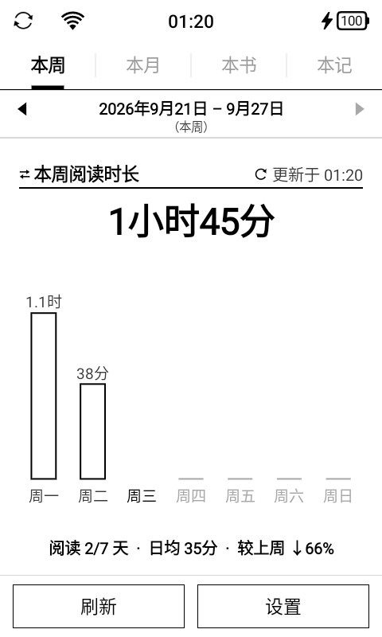
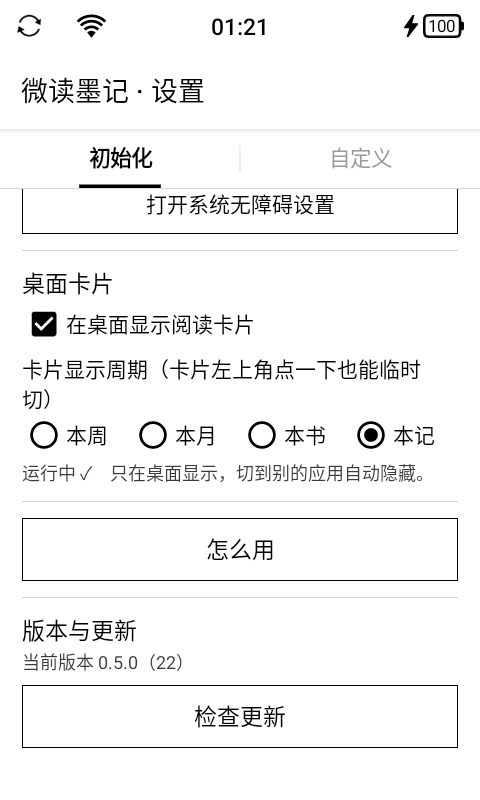

# 微读墨记 · WereadMoji

把微信读书的阅读数据搬到墨水屏上：桌面上**一张抬眼即看的卡片**，加一个认真看数据的 App。

为**没有标准小组件支持**的墨水屏阅读器而做（开发与验证机型：阅星曈 S4，Android 11 / 480×800 / 无 root）。

## 长什么样

桌面卡片贴在屏幕一处空位上，抬眼即看（这是 480×800 墨水屏的实际观感）：

<p align="left">
  
</p>

App 全屏页与设置页（「版本与更新」就是在那里检查更新）：

<p align="left">
  
  
</p>

---

## 它解决什么问题

墨水屏阅读器上想随时看到自己的阅读进度，通常有三条路，都不通：

- **标准 AppWidget** —— 这台设备上的两个桌面（Tomo 与系统原生 eLauncher）都不支持，已双重验证。
- **壁纸模式** —— 桌面壁纸层是不透明白底，卡片会被盖死。
- **普通悬浮窗** —— Android 10+ 拿不到前台包名，无法判断「现在是不是在桌面」。

所以本项目走第 4 条路：**无障碍悬浮窗**（`TYPE_ACCESSIBILITY_OVERLAY`）。它既不需要悬浮窗权限，
也能拿到窗口切换事件来判断是否在桌面。

> 关于隐私：无障碍服务**没有开启** `canRetrieveWindowContent`。它不读取屏幕上的任何内容，
> 只是借这个通道持有一个窗口，用来显示卡片。详细说明见下文「权限」。

---

## 功能

**四个视角，桌面卡片与 App 共用同一份本地数据**

| 视角 | 内容 |
|---|---|
| 本周 | 本周阅读时长、天数、笔记数，附日历网格 |
| 本月 | 本月汇总 + 月度日历热力 |
| 本书 | 正在读的书：封面、进度、剩余时间、章节 |
| 本记 | 划线与想法回顾 —— 每天的「每日一签」，可逐条翻阅 |

**桌面卡片**

- 固定在屏幕一处空位，只在桌面第 1 页显示；翻到第 2 页、切走应用、点过桌面图标都会自动让位。
- 左上角抬头：短按循环切换四个视角，长按弹出隐藏菜单（15 秒 / 1 分钟 / 5 分钟）。
- 右上角「更新于…」：短按立刻联网刷新。卡片不会自己定时联网，省电。
- 正文按卡片高度**自动铺满**：没写想法的划线也能显示满一屏行数。
- 本书态右下角「打开」可直接跳转微信读书阅读页。

**App**

- 四个页签 + 周期选择器，本周/本月可往回翻历史。
- 本记页底部一行四格：筛选（全部 / 只看想法）、上一条、换一条、导出。
- 导出为 480 宽、高度随内容伸缩的长图，存到相册 `Pictures/微读墨记/`；
  纸张底纹 × 字号三档 × 署名/落款开关，都在设置页「自定义」页调。
- 内置「怎么用」说明页，装机后不用翻文档。

---

## 安装

### 方式一：下载 APK

最新版本见 [Releases](https://github.com/Mosley-Z/WereadMoji/releases)。
国内网络若打不开 GitHub 页面，可直接用 CDN 直链（`v0.5.0` 起）：

```
https://cdn.jsdelivr.net/gh/Mosley-Z/WereadMoji@v0.5.0/dist/weread-stats-0.5.0-debug.apk
```

也可以让 App 自己更新：装过一次之后，设置页「版本与更新」里点「检查更新」即可。

### 方式二：自行构建

见下文「从源码构建」。构建环境只需要 JDK 17 + Android SDK build-tools + Python，**不需要 Gradle**。

---

## 首次配置（只做一次）

设置页分「初始化」「自定义」两页，第一次照初始化页从上往下做：

1. **填 API Key**
   Key 来自微信读书官方技能网关：浏览器打开 <https://weread.qq.com/r/weread-skills>
   → 快速配置 → 登录微信读书 → 获取 API Key → 复制。
   回到 App 点「粘贴」，再点「测试连接」确认能读到数据，最后「保存并返回」。

   > Key 只保存在本机 App 私有目录，不会上传到任何地方。

2. **开无障碍**
   点「打开系统无障碍设置」→ 已下载的服务 → 微读墨记 → 打开。

3. **打开桌面卡片**
   回到初始化页勾选「在桌面显示阅读卡片」，并在下面选一个默认形态。

> **覆盖安装（含 App 内的在线更新）不会清掉无障碍服务**，装完即可继续用。
> 只有**先卸载再安装**才需要去系统设置里重新打开一次。

---

## 权限

| 权限 | 用途 |
|---|---|
| `INTERNET` | 调用微信读书 API 拉取阅读数据 |
| `ACCESS_NETWORK_STATE` | 判断网络是否可用 |
| 无障碍服务 | 持有桌面卡片窗口（`canRetrieveWindowContent = false`） |
| `REQUEST_INSTALL_PACKAGES` | 在线更新时拉起系统安装器 |

**没有**申请的权限，以及为什么：

- 不申请「读取屏幕内容」（`canRetrieveWindowContent`）—— 只是需要一个能常驻桌面的窗口。
- 不申请存储权限 —— 数据存 App 私有目录，导出走 MediaStore。
- 不申请悬浮窗权限（`SYSTEM_ALERT_WINDOW`）—— 无障碍悬浮窗不需要。
- 不申请壁纸权限 —— 未使用壁纸方案。

---

## 在线更新怎么工作

App 会读取仓库里的一个版本清单 `update.json`，与自身 `versionCode` 比较（整数比较，不做字符串比较）。

```json
{
  "versionCode": 22,
  "versionName": "0.5.0",
  "notes": "新增「检查更新」与在线更新：设置页可直接下载并安装新版本",
  "apk": "dist/weread-stats-0.5.0-debug.apk",
  "size": 245000,
  "sha256": "..."
}
```

触发方式：**启动时静默检查（每天至多一次）** + 设置页手动「检查更新」。发现新版本只在设置页显示提示，
不弹窗打断。下载完成后校验 `sha256`，再拉起系统安装器。

**为什么版本清单和 APK 用两个不同的源？**

| 用途 | 主源 | 理由 |
|---|---|---|
| 版本清单 | `raw.githubusercontent.com/…/main/update.json` | raw 的缓存只有几分钟，能立刻反映新版本 |
| APK | `cdn.jsdelivr.net/gh/…@v0.5.0/…apk` | 用 tag 引用可永久缓存 + CDN 加速；APK 内容本就不可变，正合适 |

jsDelivr 对**分支**引用的缓存长达数小时到数天。若清单也用 `@main`，会出现「新版本已发布但设备查不到」的滞后。
两者互为回落，任一源不可用仍能更新。

> 这些域名的可达性做过实测：`github.com` 在部分国内网络下不可达，但
> `raw.githubusercontent.com`、`cdn.jsdelivr.net`、`api.github.com`、`objects.githubusercontent.com` 均可用。
> 因此 App 内更新**不使用** `releases/download/...` 这类以 `github.com` 开头的地址。

---

## 从源码构建

### 依赖

- JDK 17 或更高
- Android SDK：`build-tools;33.0.2` + `platforms;android-33`
- Python 3（构建脚本用它做打包与清单生成）

### 构建

```bash
bash tools/build.sh
# 产物：dist/weread-stats-<版本号>-debug.apk 与 dist/update.json
```

脚本会自动探测 `JAVA_HOME` / `ANDROID_HOME` / `PYTHON`，也可以用环境变量覆盖。
签名使用仓库内的 `keystore/debug.keystore`（口令即标准调试口令 `android`）。

### 发版流程

1. 改 `version.properties` 里的 `VERSION_NAME` / `VERSION_CODE` / `NOTES`
   （`VERSION_CODE` 必须**递增**，App 靠它判断有没有新版）
2. `bash tools/build.sh`
   —— 产物出在 `dist/`：APK + `update.json`（含体积与 sha256），并自动校验 `VERSION_CODE` 递增
3. `git add -A && git commit && git push`
4. 打 tag 并推送：`git tag -a v<VERSION_NAME> -m "..." && git push origin v<VERSION_NAME>`

第 4 步会触发 [`.github/workflows/release.yml`](.github/workflows/release.yml)，
自动创建 Release 并把 APK 挂成附件（发布前会先校验 APK 的 sha256 与 `update.json` 一致，
不一致就拒绝发布）。不需要配置任何密钥，用的是 GitHub 自带的 `GITHUB_TOKEN`。

> **为什么要打 tag**：App 的下载地址用 tag 引用。jsDelivr 与 raw 对 tag 都是永久缓存且立刻可用；
> 若用分支引用，CDN 缓存会导致新 APK 读不到。
>
> 补建历史版本的 Release：在 Actions 页面手动 Run workflow，填入 tag 即可。

### 为什么不用 Gradle

目标设备是低内存墨水屏（`ro.config.low_ram=true`，堆 128–256MB），且只有 `armeabi-v7a` 32 位 ABI。
所以本项目坚持**纯 Java、零第三方依赖、无 AndroidX、无 Kotlin**，最终 APK 只有约 240KB。

`tools/build.sh` 直接调用 `aapt2` / `javac` / `d8` / `zipalign` / `apksigner` 完成构建，
换台机器只要有 JDK 和 Android SDK 就能跑，不需要网络下载依赖。

> 仓库里**不含** `build.gradle`：早期试水时的残留内容已过期（停在 `versionCode 2`），
> 保留会误导构建。若你想用 Android Studio 打开，需要自己补一份 Gradle 配置。

---

## 项目结构

```
app/src/main/
  java/com/inkread/weekread/
    CardA11yService.java    无障碍服务 —— 桌面卡片的宿主与手势分发
    WeekCardView.java       卡片自绘（四态布局、按钮、筛选格）
    CardSpec.java           几何唯一来源（卡片位置、字号、命中区）
    MainActivity.java       App 全屏四态
    NoteStore.java          划线数据：索引 + 按需读书抽样
    WereadApi.java          微信读书网关客户端（纯 HttpURLConnection）
    UpdateChecker.java      检查更新
    ApkInstaller.java       下载、校验、拉起安装器
    ApkProvider.java        暴露 APK 给系统安装器（手写，无 AndroidX）
  res/raw/help.txt          内置使用说明（App 内「怎么用」直接读它）
  res/layout/, res/values/
tools/build.sh              免 Gradle 构建脚本
version.properties          版本号唯一来源
dist/                       构建产物 + update.json
.github/workflows/          打 tag 自动发 Release（附 APK）
```

---

## 技术笔记

- **几何唯一来源是 `CardSpec.java`**。改卡片布局请改那里，不要在 View 里写魔法数字。
  用 uiautomator 看窗口外框会对不上（差 3px），以 `CardSpec` 为准。
- **字号单位**：1「号」= 屏高 × 0.0015，因此换分辨率时字号会等比缩放。
- **本记抽样**：全库可能几千条划线，不会一次性全读。索引常驻内存（按文件指纹判失效），
  每次按条数加权挑书、只读那一两本、书内随机取 40 条。换一批只需几十毫秒。
- **无限动画**：墨水屏上动画是灾难，全项目没有动画，卡片正文长度变化靠重绘。

---

## 已知限制

- 桌面卡片正文若仍超出卡片高度，末尾显示 `…`，完整内容需去 App 看。
- 本记「换一条」把当前 40 条抽完后，抽下一批会有约 0.4 秒停顿（要读新的书文件）。
- 书名特别长时，卡片上作者那行可能被挤掉一部分。
- 卡片只在桌面第 1 页显示，第 2 页不显示（有意为之）。
- 数据全部来自微信读书网关，**没有本地缓存时首次打开需要联网**。

---

## 免责声明

本项目是**非官方**第三方工具，与腾讯、微信读书无任何关联。它通过微信读书官方技能网关
（`weread.qq.com/r/weread-skills`）读取你自己的阅读数据，需要你自行申请 API Key。

请遵守微信读书的服务条款。若官方接口变更导致不可用，本项目不承担任何责任。

本项目不收集、不上传任何用户数据。所有数据仅保存在本机 App 私有目录。

---

## 许可证

[MIT](LICENSE)
